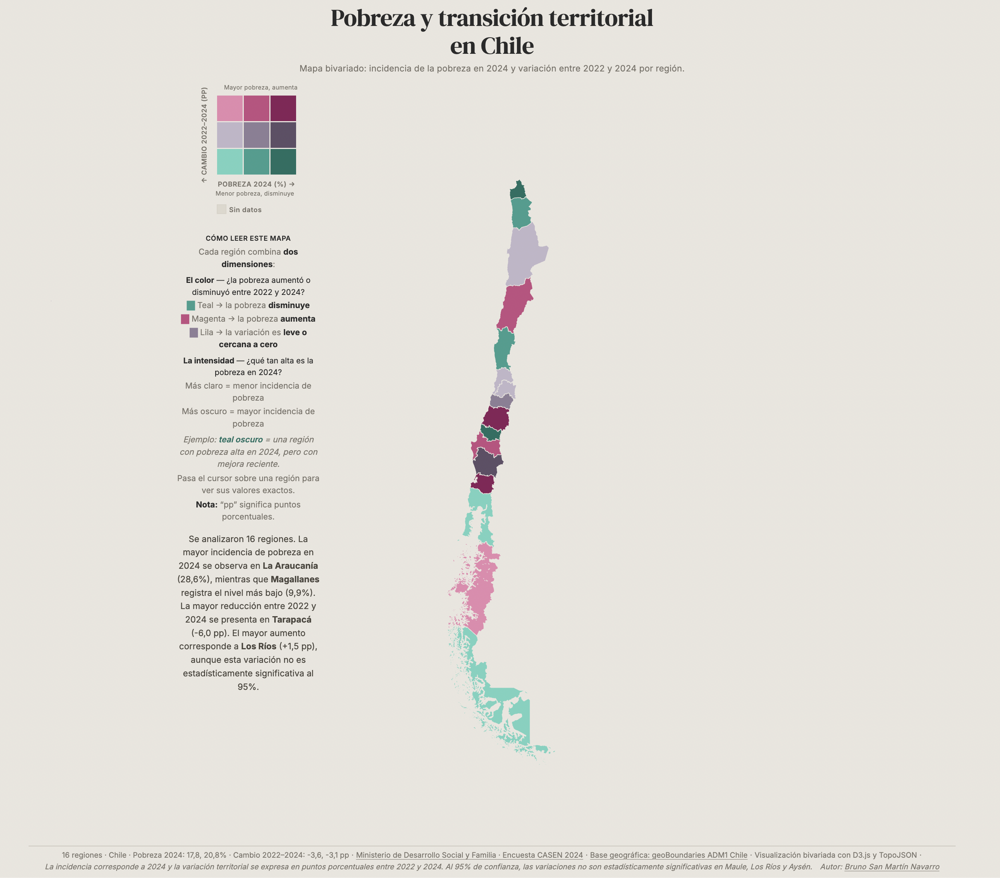

# Pobreza y transición territorial en Chile

<p align="left">
  Visualización bivariada regional para analizar la relación entre <strong>incidencia de pobreza en 2024</strong> y su <strong>variación entre 2022 y 2024</strong> en Chile.
</p>

<p align="left">
  <a href="https://img.shields.io/badge/HTML5-E34F26?style=for-the-badge&logo=html5&logoColor=white"></a>
  <a href="https://img.shields.io/badge/CSS3-1572B6?style=for-the-badge&logo=css3&logoColor=white"></a>
  <a href="https://img.shields.io/badge/JavaScript-F7DF1E?style=for-the-badge&logo=javascript&logoColor=111"></a>
  <a href="https://img.shields.io/badge/D3.js-F9A03C?style=for-the-badge&logo=d3.js&logoColor=white"></a>
  <a href="https://img.shields.io/badge/TopoJSON-3B3B3B?style=for-the-badge"></a>
  <a href="https://img.shields.io/badge/Python-3776AB?style=for-the-badge&logo=python&logoColor=white"></a>
</p>



## Resumen

Este proyecto presenta un mapa bivariado interactivo para explorar diferencias territoriales de pobreza por región en Chile. La visualización permite leer, en una sola capa:

- nivel de pobreza en 2024 (intensidad del color)
- dirección del cambio entre 2022 y 2024 (familia cromática)

El objetivo es entregar una lectura rápida y defendible para análisis territorial, con foco en comparación regional.

## Enfoque metodológico

- Unidad geográfica: regiones de Chile (ADM1)
- Join espacial-tabular: `shapeID`
- Variable A (`x`): pobreza 2024 (%)
- Variable B (`y`): cambio 2022–2024 (pp)
- Clasificación: matriz bivariada 3x3 (cuantiles)
- Interacción: tooltip con nivel, variación y significancia estadística al 95%

## Fuentes

- Ministerio de Desarrollo Social y Familia, Encuesta CASEN 2024  
  https://observatorio.ministeriodesarrollosocial.gob.cl/storage/docs/casen/2024/Resultados_Pobreza_Ingresos_Casen_2024.pdf
- Base geográfica regional (ADM1), geoBoundaries  
  https://www.geoboundaries.org/

## Nota de interpretación

- La variación 2022–2024 se expresa en puntos porcentuales (pp).
- La significancia estadística se reporta al 95% de confianza, según la fuente oficial.

## Estructura del proyecto

```text
.
├── index.html
├── css/
│   └── style.css
├── js/
│   ├── bivariate.js
│   ├── legend.js
│   ├── main.js
│   └── tooltip.js
├── data/
│   ├── chile_adm1.topojson
│   ├── chile_data.csv
│   ├── chile_data.backup_dummy.csv
│   └── fuentes_casen/
├── docs/
│   └── assets/
│       └── map.png
└── scripts/
    └── merge_casen_pobreza.py
```

## Ejecución local

```bash
cd ~/yusnelkis.github.io/Portafolio/bivariate-chile-map
python3 -m http.server 8000
```

Abrir en navegador: `http://localhost:8000`

## Actualización de datos

Para regenerar `data/chile_data.csv` desde la base CASEN consolidada:

```bash
python3 scripts/merge_casen_pobreza.py
```

Nota: el script actual usa rutas absolutas internas del proyecto.

## Contacto

Si quieres conversar sobre este proyecto, colaboraciones o consultoría en analítica y visualización de datos:

[](https://www.linkedin.com/in/sanmabruno/)

Perfil: https://www.linkedin.com/in/sanmabruno/
